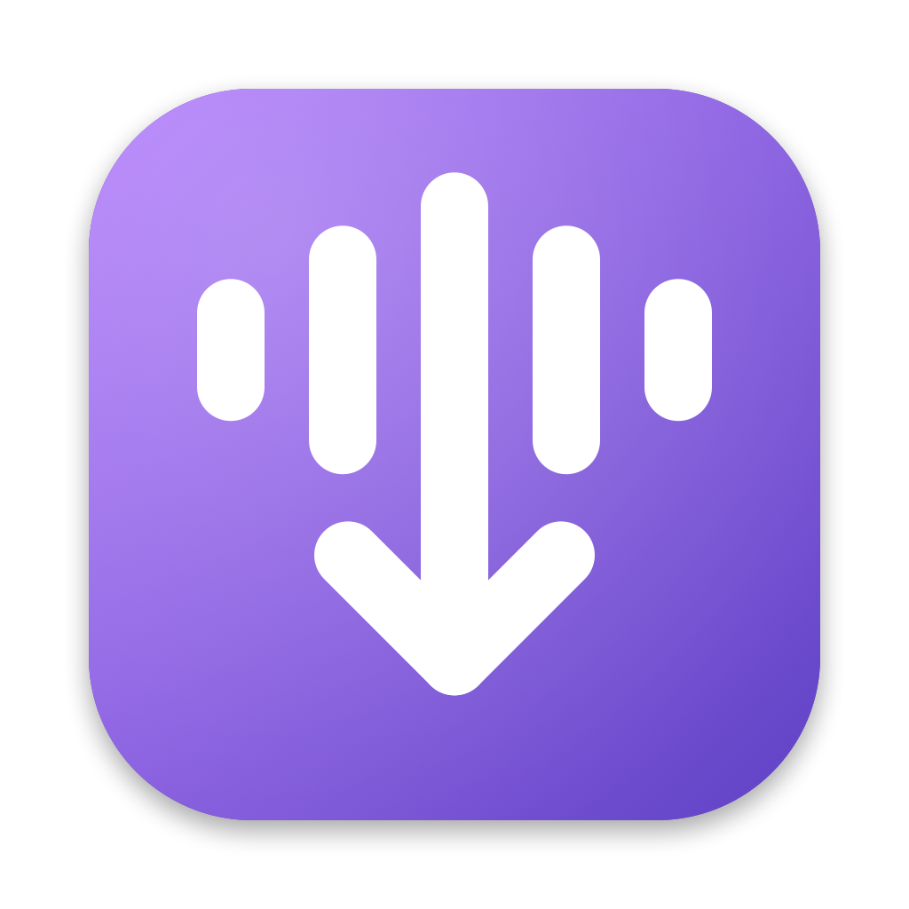

# Podcast Downloader



A native macOS app for finding podcasts, subscribing to their RSS feeds, and
downloading episodes to a folder of your choosing.

- **Search** the Apple Podcasts directory by name, host, or topic — or paste any
  RSS feed URL directly.
- **Subscribe** to shows; the app keeps track of their episodes and can
  automatically download new ones each time it refreshes.
- **Latest Episodes** — one list of the 100 newest episodes across every
  subscription, newest first, so you can see what's new without clicking
  through each show.
- **Download** individual episodes or an entire back catalog, with a concurrent
  download queue and per-episode progress.
- **Built-in player** — double-click an episode to play it in the player bar at
  the bottom of the window: play/pause, 10-second skip back/forward, scrubber,
  playback speed (0.75×–2×), and it remembers where you left off in each episode.
  Works with the keyboard media keys and Control Center's Now Playing. If an
  episode isn't downloaded yet, it's fetched first and starts playing
  automatically. "Open in External App" is in the right-click menu if you'd
  rather use Music or another player.
- **Mini player** — the ⤡ button on the player bar (or ⇧⌘M) collapses the whole
  window down to a small always-movable player with artwork, scrubber, and
  transport controls; pin it to keep it above other windows. ⤢ brings the full
  window back exactly where it was.
- **One folder, always** — you pick a single master folder and every podcast
  gets its own sub-folder named after the show. Change the folder in Settings
  and the app moves your whole library there. The Downloads tab shows exactly
  what's in that folder.

  ```
  ~/Downloads/Podcasts/
  ├── Some Podcast/
  │   ├── 2026-09-01 - Episode 42.mp3
  │   └── 2026-09-08 - Episode 43.mp3
  └── Another Show/
      └── 2026-08-30 - Pilot.m4a
  ```

## Requirements

- macOS 14 (Sonoma) or later
- Xcode 15+ command-line tools (for building)

## Building

```bash
scripts/build_app.sh
open "build/Podcast Downloader.app"
```

For development you can also run the app straight from the package:

```bash
swift run
```

## Project layout

```
Package.swift                     Swift Package Manager manifest
Resources/Info.plist              Bundle metadata used by build_app.sh
scripts/build_app.sh              Builds and packages the .app
scripts/make_icon.swift           Regenerates Resources/AppIcon.icns
Sources/PodcastDownloader/
  PodcastDownloaderApp.swift      @main entry point, menu commands, settings scene
  Models/                         Podcast, Episode, DownloadItem
  Services/
    AppModel.swift                Glue between settings, library and downloads
    AppSettings.swift             Master folder + concurrency (UserDefaults)
    Library.swift                 Subscriptions & episode cache (JSON on disk)
    LibraryFolder.swift           Scans / relocates the master folder
    FeedParser.swift              RSS 2.0 + iTunes-extension parser
    PodcastSearchService.swift    Apple Podcasts search API client
    DownloadManager.swift         URLSession download queue
    Player.swift                  AVPlayer-based audio player + media keys
    WindowMode.swift              Full window <-> mini player switching
  Views/                          SwiftUI screens
```

## Where data lives

| What | Where |
|------|-------|
| Downloaded audio | Master folder (default `~/Downloads/Podcasts`, change in **Settings ⌘,**) |
| Subscriptions & episode cache | `~/Library/Application Support/PodcastDownloader/library.json` (download locations stored relative to the master folder) |
| Preferences | `UserDefaults` |

## Keyboard shortcuts

| Action | Shortcut |
|---|---|
| Play / Pause | ⌥ Space (or the keyboard's play key) |
| Back / forward 10 s | ⌥⌘← / ⌥⌘→ |
| Stop | ⌘. |
| Mini player / full window | ⇧⌘M |
| Refresh all subscriptions | ⌘R |
| Settings | ⌘, |

## Tests

```bash
swift test
```

`FeedParserTests` are pure unit tests. `NetworkTests` hit the real Apple search
API and download one episode into a temp folder; they skip themselves when offline.
